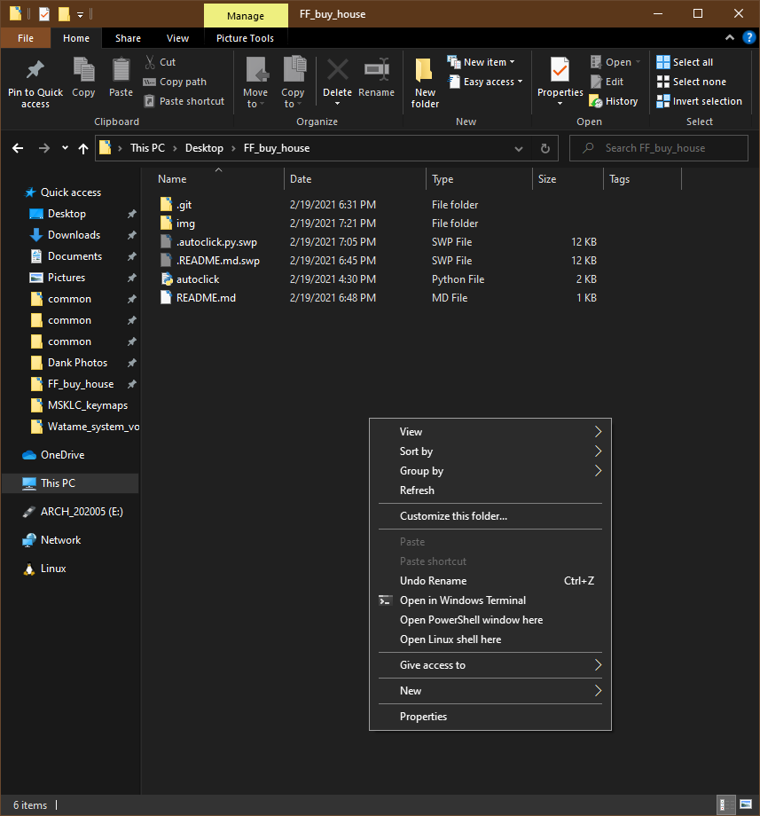
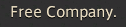
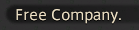

# Script to buy house in FFXIV

## Dependencies:

You will need python:

[https://www.python.org/downloads/]

This works on python 3.9.1

It also needs ``PyAutoGUI`` for mouse, keyboard and GUI control, and ``Pillow`` for image/screen processing.

## Windows

After you have installed python, run from below in CMD and Powershell: 

```
py -m pip install -r requirements.txt
```

Or alternatviely:

```
py -m pip install pyautogui
py -m pip install Pillow
```

## Usage:

Once you have either cloned or downloaded this, go into the folder with ``FileExplorer`` and ``Shift`` + ``Right Click``.




Select 'Open PowerShell window here' and run:

```
py .\autoclick.py
```

Position the game, so that the the placard is centered in the left third of the screen:


It should hopefully click the placard and find be able to find and click the UI elements.

You can of course provide your own images for the UI elements, if you find that it doesn't work. 
You may also have to edit the code to adjust the image pathes.

Here are the default images:






